## RAG基础 

**学习目标:**

1. 掌握 RAG的作用
2. 熟悉 RAG的工作流程
3. 熟悉 向量与embedding
4. 熟悉 向量数据库的使用
5. 熟悉 平台搭建RAG的方式


### 一. RAG-检索增强生成

#### 1. LLM的缺陷

##### 1.1LLM存在幻觉现象

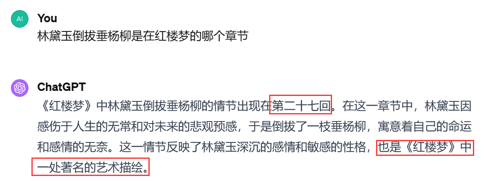

- 幻觉: 是指模型生成的内容看似合理，但实际与事实不符、逻辑错误或缺乏真实依据的现象 
  - 形成原因:
    - **训练数据噪声**：模型从海量文本中学习，但数据本身包含错误、偏见或虚构内容（例如网络谣言、小说情节），模型可能误将其视为真实知识。 
    - **概率优先而非真实性**：模型目标是生成“最符合上下文概率分布”的文本，而非追求事实正确性。当缺乏明确答案时，模型倾向于用高频词汇或合理句式“填补空白”(做填词游戏)。 

##### 1.2 LLM知识更新缓慢

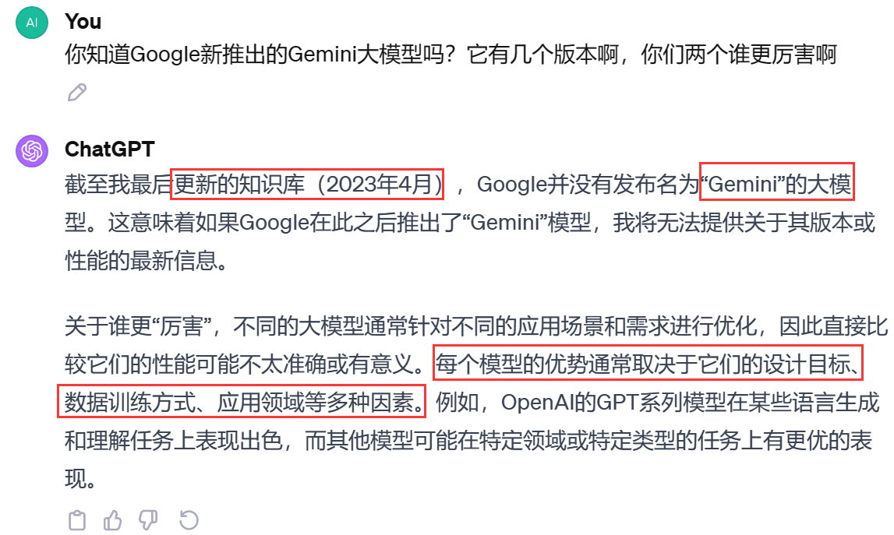

##### 1.3 LLM对领域知识的理解有限 

- 在一些较为浅显的领域，大型语言模型可能通过之前的大量训练数据获得了相应的能力。但当涉及到更深层次的专业领域时，这些模型往往会出现所谓的“幻觉”问题，即生成的信息可能偏离事实或专业知识的真实性。 

- 形成原因:

  - 训练数据的覆盖广度与深度矛盾(**广度优先** ):LLM的训练数据覆盖全网公开文本（书籍、网页、论文等），但**领域知识往往分布稀疏** 


##### 1.4 RAG的引入

​     **RAG的初衷是为了增强大模型的事实性，时效性，减少幻觉，引入专业知识优化生成回复**


#### 2. RAG的概念

- RAG（Retrieval Augmented Generation）顾名思义，通过检索外部数据，增强大模型的生成效果。
- 类比:你可以把这个过程想象成开卷考试。让LLM先翻书，再回答问题。
- 举例: 我想询问LLM有关于我公司内部的请假流程它肯定不知道,但是我把公司的员工手册先给它看,当我在询问的时候他就会知道     


#### 3. RAG系统工作流程图解

- RAG论文：<https://arxiv.org/pdf/2312.10997> 

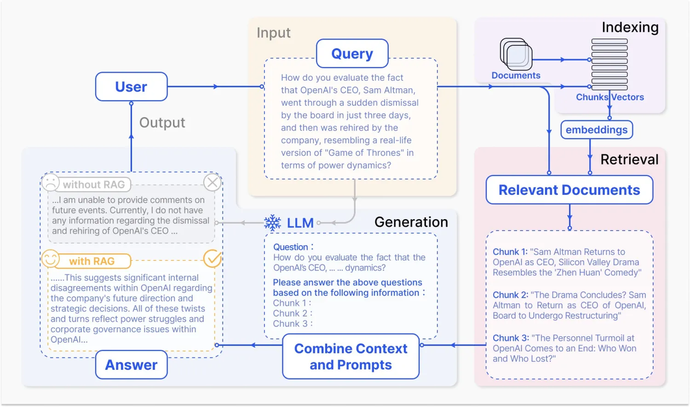

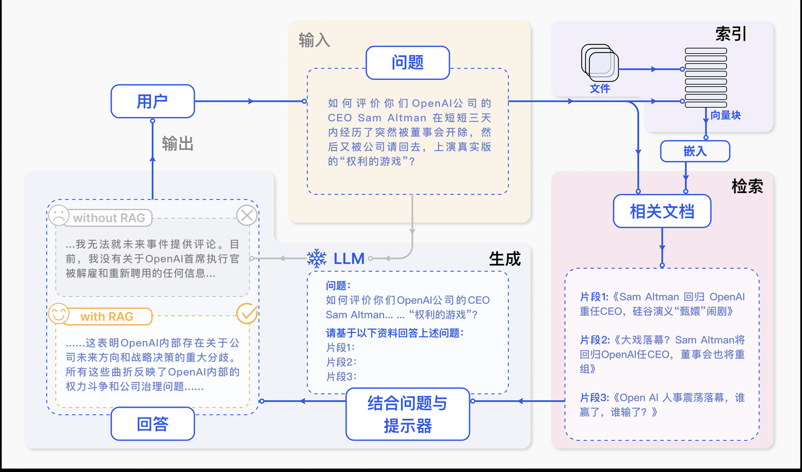

可以看出，它主要包括三个步骤：

1. **索引化：**将文档切分成片段，再编码为向量，存储在向量数据库里。
2. **检索：**检索到与问题相似度最高的top k 的片段。
3. **生成：**将原始问题和检索得到的“块”都作为LLM的输入，令其生成最终的回答。

RAG的研究范式一直在持续演进，我们将其发展过程分为三个阶段：朴素RAG（Naive RAG）、高级RAG（Advanced RAG）和模块化RAG（Modular RAG），如图所示 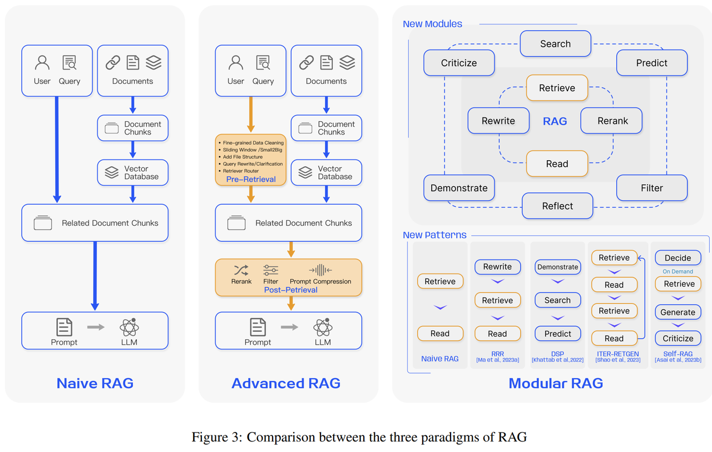

##### 3.1 模块化RAG

用是通过**将检索过程拆分为多个独立且可灵活组合的模块**，针对性优化不同环节，从而解决传统 RAG 的局限性（如检索噪声大(比方文本里面的错别字,一些干扰信息这些)、灵活性低等,以下是其具体作用及优势： 

- **分层过滤**：将检索拆分为多个模块（例如：粗筛 → 精筛 → 上下文适配），逐步缩小候选范围，减少噪声干扰。 
- **动态权重调整**：不同模块可针对不同任务分配权重（如法律领域侧重法条精确性，创意写作侧重语义关联性）。 


### 二. Naive RAG

Naive RAG遵循一个传统的处理流程，包括索引、检索和生成三个阶段 

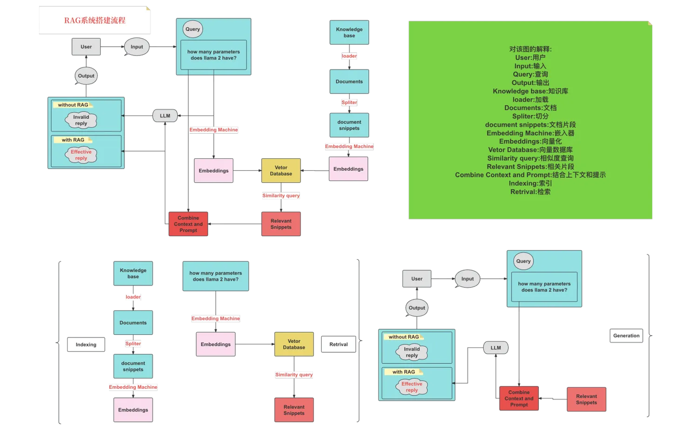


#### 1. 文档分块

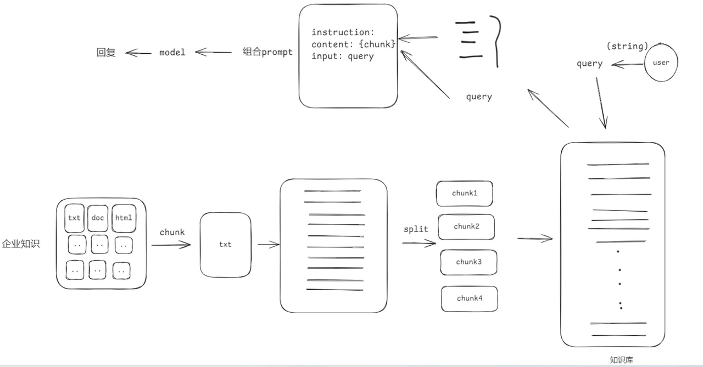

分块策略:

- 按照句子来切分
- 按照字符数来切分
- 按固定字符数 结合overlapping window
- 递归方法  RecursiveCharacterTextSplitter

##### 1.1 **按照句子来切分** 

```python
# -*- encoding:utf-8 -*-
import re

text = "自然语言处理（NLP），作为计算机科学、人工智能与语言学的交融之地，致力于赋予计算机解析和处理人类语言的能力。在这个领域，机器学习发挥着至关重要的作用。利用多样的算法，机器得以分析、领会乃至创造我们所理解的语言。从机器翻译到情感分析，从自动摘要到实体识别，NLP的应用已遍布各个领域。随着深度学习技术的飞速进步，NLP的精确度与效能均实现了巨大飞跃。如今，部分尖端的NLP系统甚至能够处理复杂的语言理解任务，如问答系统、语音识别和对话系统等。NLP的研究推进不仅优化了人机交流，也对提升机器的自主性和智能水平起到了关键作用。"

# 正则表达式匹配中文句子结束的标点符号
sentences = re.split(r'(。|？|！|\..\..)', text)

# 重新组合句子和结尾的标点符号
chunks = []
for sentence, punctuation in zip(sentences[::2], sentences[1::2]):
    chunks.append(sentence + (punctuation if punctuation else ''))

print(chunks)
for i, chunk in enumerate(chunks):
    print(f"块 {i + 1}: {len(chunk)}: {chunk}")

```

##### 1.2 **按照固定字符数切分** 

```python
# -*- encoding:utf-8 -*-

def split_by_fixed_char_count(text, count):
    chunks = []
    for i in range(0, len(text), count):
         chunks.append(text[i:i + count])
    return chunks


text = "自然语言处理（NLP），作为计算机科学、人工智能与语言学的交融之地，致力于赋予计算机解析和处理人类语言的能力。在这个领域，机器学习发挥着至关重要的作用。利用多样的算法，机器得以分析、领会乃至创造我们所理解的语言。从机器翻译到情感分析，从自动摘要到实体识别，NLP的应用已遍布各个领域。随着深度学习技术的飞速进步，NLP的精确度与效能均实现了巨大飞跃。如今，部分尖端的NLP系统甚至能够处理复杂的语言理解任务，如问答系统、语音识别和对话系统等。NLP的研究推进不仅优化了人机交流，也对提升机器的自主性和智能水平起到了关键作用。"

# 假设我们按照每100个字符来切分文本
chunks = split_by_fixed_char_count(text, 100)
for i, chunk in enumerate(chunks):
    print(f"块 {i + 1}: {len(chunk)}: {chunk}")
```

##### 1.3 **按固定字符数 结合overlapping window** 

```
# -*- encoding:utf-8 -*-
def sliding_window_chunks(text, chunk_size, stride):
    chunks = []
    for i in range(0, len(text), stride):
        chunks.append(text[i:i + chunk_size])
    return chunks


text = "自然语言处理（NLP），作为计算机科学、人工智能与语言学的交融之地，致力于赋予计算机解析和处理人类语言的能力。在这个领域，机器学习发挥着至关重要的作用。利用多样的算法，机器得以分析、领会乃至创造我们所理解的语言。从机器翻译到情感分析，从自动摘要到实体识别，NLP的应用已遍布各个领域。随着深度学习技术的飞速进步，NLP的精确度与效能均实现了巨大飞跃。如今，部分尖端的NLP系统甚至能够处理复杂的语言理解任务，如问答系统、语音识别和对话系统等。NLP的研究推进不仅优化了人机交流，也对提升机器的自主性和智能水平起到了关键作用。"

chunks = sliding_window_chunks(text, 100, 50)  # 100个字符的块，步长为50

for i, chunk in enumerate(chunks):
    print(f"块 {i + 1}: {len(chunk)}: {chunk}")
```

##### 1.4  递归方法   

```python
# -*- encoding:utf-8 -*-
from langchain.text_splitter import RecursiveCharacterTextSplitter
# 模块下载 pip install langchain
text = """
自然语言处理（NLP），作为计算机科学、人工智能与语言学的交融之地，致力于赋予计算机解析和处理人类语言的能力。在这个领域，机器学习发挥着至关重要的作用。利用多样的算法，机器得以分析、领会乃至创造我们所理解的语言。从机器翻译到情感分析，从自动摘要到实体识别，NLP的应用已遍布各个领域。随着深度学习技术的飞速进步，NLP的精确度与效能均实现了巨大飞跃。如今，部分尖端的NLP系统甚至能够处理复杂的语言理解任务，如问答系统、语音识别和对话系统等。NLP的研究推进不仅优化了人机交流，也对提升机器的自主性和智能水平起到了关键作用。
"""
'''
    RecursiveCharacterTextSplitter 是一个用于将文本分割成较小块的工具。
    它特别适用于需要递归地按字符拆分文本的场景，例如处理超长文档或嵌套结构的文本
    chunk_size = 分割长度
    chunk_overlap = 重叠长度
    length_function = 固定写法（用于定义如何计算每个文本片段的长度）
'''
splitter = RecursiveCharacterTextSplitter(
    chunk_size=50,
    chunk_overlap=10,
    length_function=len,
)

chunks = splitter.split_text(text)

for i, chunk in enumerate(chunks):
    print(f"块 {i + 1}: {len(chunk)}: {chunk}")
```


### 三. 向量与Embedding

#### 1. 向量

在数学中，向量（也称为欧几里得向量、几何向量），指具有大小（magnitude）和方向的量。它可以形象化地表示为带箭头的线段。箭头所指：代表向量的方向；线段长度：代表向量的大小。

1. 将文本转成一组浮点数：每个下标 `i`，对应一个维度
2. 整个数组对应一个 `n` 维空间的一个点，即**文本向量**又叫 Embeddings
3. 向量之间可以计算距离，距离远近对应**语义相似度**大小

- 在计算机中我们用数组来表述向量

```
import numpy as np

v = np.array([3, 4])  # 数组表示向量
magnitude = np.linalg.norm(v)  # 计算大小
unit_vector = v / magnitude    # 计算单位向量（方向）
angle = np.arctan2(v[1], v[0]) * 180 / np.pi  # 角度（度）

print(f"大小: {magnitude}")
print(f"单位向量 (方向): {unit_vector}")
print(f"与x轴角度: {angle:.1f}°")
```


#### 2. AI中数据的本质

> 在计算机当中所有数据的存储都是二进制,不管是图片还是文字,都是以二进制的内容进行存储的

##### 1.1 图片计算机存储

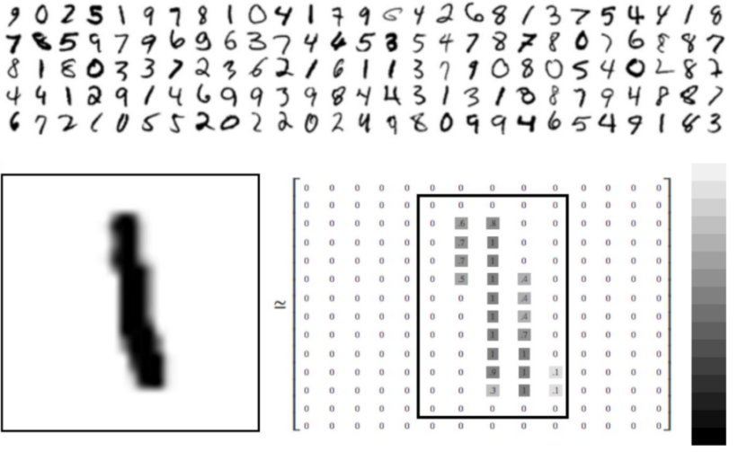

- 图片信息都是都是像素内容当前图片是一种 14X14的一张灰度图片
- 灰度图片的0是黑色 255是白色, 计算机就会用数字来表示这些内容数字越大就会越黑
- 彩色图片的存储就把原来的一个像素点的内容变成了三个  

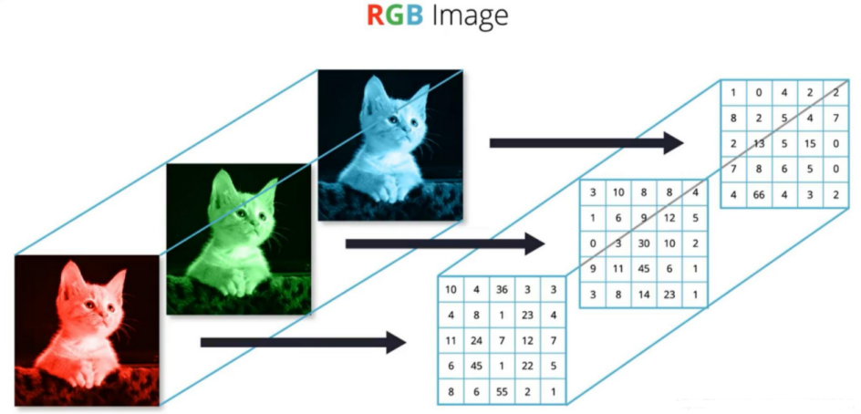


##### 1.2 英文的字符本质

**ASCII (American Standard Code for Information Interchange 美国信息交换标准代码)** 由128个字符构成，是基于拉丁字母的一套电脑编码系统 

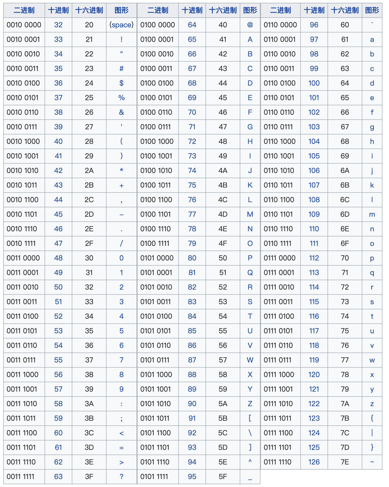

- 有了对照之后我们就能在电脑中描述英文的内容

##### 1.3  中文字符的本质

1. ASCII扩展:在早期的计算机系统中，大多采用ASCII码来表示字符.ASCII只能表示128个字符，主要用于表示英文字符。为了表示汉字，各地开始开发基于ASC的扩展，如GB2312(中国)、Big5(中国台湾)、EUC-JP(日本)等，这些编码将ASCII扩展到了256个或更多的字符，使得它们可以表示汉字或者其他非拉丁字母的字符。但这些编码往往只能表示一种语言，且在多种语言混合使用时会出现问题.
2. ‌**GB2312码对照表**‌包括6763个汉字，其中一级汉字3755个，二级汉字3008个 

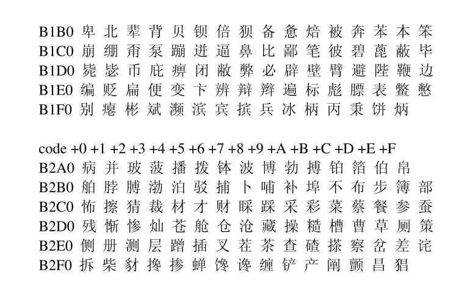

3. **Unicode和UTF-8**:为了解决多种语言混合使用时的问题，Unicode应运而生，Unicode是一个包含全世界所有字符的编码系统，它将每个字符都映射到一个唯一的数值，UTF-8是Unicode的一种实现方式，它是一种可变长度的编码方式，可以使用1到4个字节来表示一个字符。
4. **One-hot编码(词汇表)**:在机器学习和深度学习的应用中，文本数据通常需要转换为数值型数据，One-hot编码是一种常用的转换方式。在One-hot编码中，每个汉字都被表示为一个只有一个元素为1其余元素全为0的向量。向量的长度等于汉字的总数量，1的位置表示该汉字的索引。One-hot编码的一个主要优点是它简单直观，但当汉字的数量非常大时，One-hot编码会占用大量的内存.
5. **基于深度学习的语言模型**:在最近的发展中，一种基于深度学习的自然语言处理技术被用于表示文字，包括汉字。这种技术将每个字或词映射到一个低维向量(称为词嵌入)，这个向量可以捕捉到字或词的语义信息。(如何才能把数据映射到低维向量呢?)

#### 3. 表示学习

**表示学习**:通过学习算法自动地从原始数据中学习到一种表示形式或特征表示，该表示形式能够更好地表达数据的重要特征和结构。表示学习的目标是将输人数据转换为具有良好表示能力的特征空间，使得在该空间中的数据具有更好的可分性、可解释性或推理能力

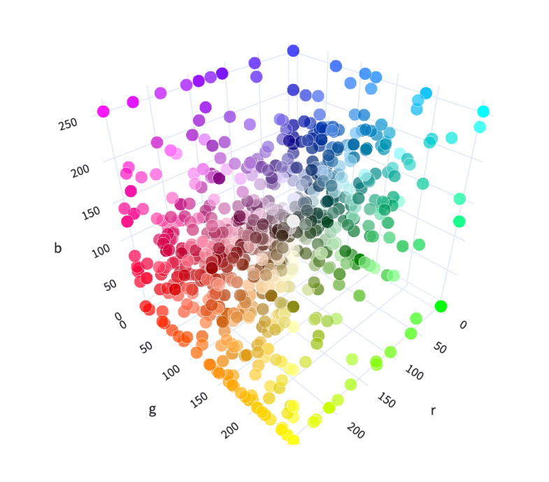

##### 2.1 如何学习

我们需要让大模型知道一个词的含义改怎么做呢

举例说明:

- 我想让大模型知道苹果, 但是大模型是没有办法理解的  
- 可以把苹果的一些特征给抽出来,把抽出来的数据内容用数字来表示(颜色RGB, 大小, 形状, .....)

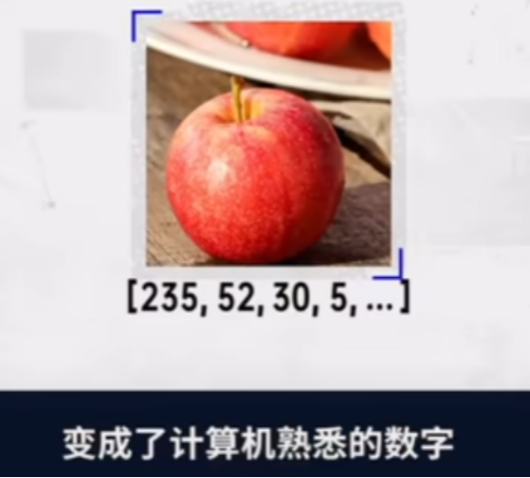

- 然后可以把这些数据存在向量空间当中 

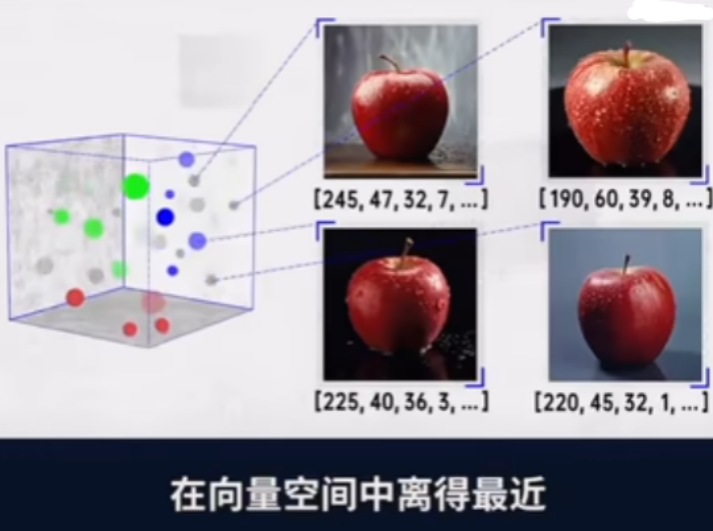

- 会有很多这样的苹果数据, 下次我们让大模型看一个苹果,发现他的向量的位置离这个向量空间的位置很近,那么大模型就会知道这个是苹果 (使用余弦相似度或欧氏距离计算向量距离 )  
- 那么大模型是怎么回答问题的呢?

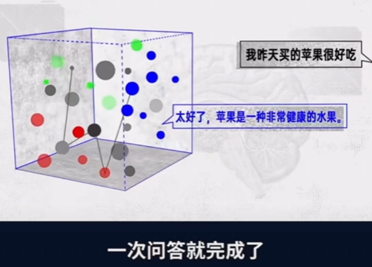

- 我们所提的问题会转换成向量, 然后会拿这个向量在向量空间进行对比,找到和苹果相近的内容,比方说健康,水果,离的比较近那么大模型会根据概率的问题把这句话完整的写出来(当然其中还需要很多其他的东西)
- 我们之前给的数据的向量其实是非常复杂的,表示学习会对向量进行优化得到的一个新的向量内容我们会叫做**嵌入**
- 总结: 我们拿到的数据会进过**表示学习**得到新的向量

#### 4. Embedding

- 嵌入:表示学习的一种形式，通常用于将高维数据映射到低维空间中的表示形式。嵌入可以是词嵌入、图像嵌入、图嵌入等。例如，在自然语言处理中，词嵌入将词语映射到低维向量空间，以捕捉词语之间的语义和句法关系。在图像处理中，图像嵌入将图像映射到低维向量空间，以表示图像的视觉特征。

##### 4.1 转换代码

- 如何才能把字符转换成向量?

- 我们在使用的时候不需要过多关注我们都是使用现成的转换工具

```python
from openai import OpenAI
from dotenv import load_dotenv
import os

load_dotenv()
client = OpenAI(api_key=os.getenv("api_key"), base_url=os.getenv("base_url"))


def get_embeddings(texts, model="text-embedding-v1"):
    #  texts 是一个包含要获取嵌入表示的文本的列表，
    #  model 则是用来指定要使用的模型的名称
    #  生成文本的嵌入表示。结果存储在data中。
    data = client.embeddings.create(input=texts, model=model).data
    # print(data)
    # 返回了一个包含所有嵌入表示的列表
    return [x.embedding for x in data]


test_query = ["我爱你"]

vec = get_embeddings(test_query)
print(vec)
#  "我爱你" 文本嵌入表示的列表。
print(len(vec))
#  "我爱你" 文本的嵌入表示。
print(vec[0])
#  "我爱你" 文本的嵌入表示的维度。3072
print(len(vec[0]))
```

##### 4.2 向量模型本地部署

- Huggingface：https://huggingface.co/
- Hugging Face 是一个专注于 **机器学习**（尤其是自然语言处理，NLP）的**开源平台和社区**，提供从模型开发、训练、部署到共享的一站式工具和资源 
- 国内的镜像地址：https://hf-mirror.com/
- 魔搭社区：https://www.modelscope.cn/my/overview
- 在网址中找到自己需要的文本向量模型

```
# 模型下载
from modelscope import snapshot_download
# pip install modelscope
model_dir = snapshot_download("BAAI/bge-large-zh-v1.5", cache_dir="D:\LLM\Local_model")
```

- 使用本地的向量模型进行向量化 

```python
# pip install sentence-transformers
# 用来加载模型,并使用模型生成向量
from sentence_transformers import SentenceTransformer

model_path = r"D:\LLM\Local_model\BAAI\bge-large-zh-v1___5"  # 替换为实际路径
model = SentenceTransformer(model_path)

sentences = [
    "你好",
    '你'
]

# 生成向量（默认返回numpy数组）
embeddings = model.encode(sentences)
print(embeddings)
print(embeddings.shape)  # 输出: (2, 1024)  （维度取决于模型）
```

#### 5. **向量间的相似度计算** 

常用的相似度计算方法包括：

- 余弦相似度Cosine：基于两个向量夹角的余弦值来衡量相似度。
  - 计算公式: 两个向量的乘积 / 两个向量范数的乘积   A×B / ∥A∥ × ∥B∥ 
  - 范数: l1(绝对值), l2(勾股定理), l无穷

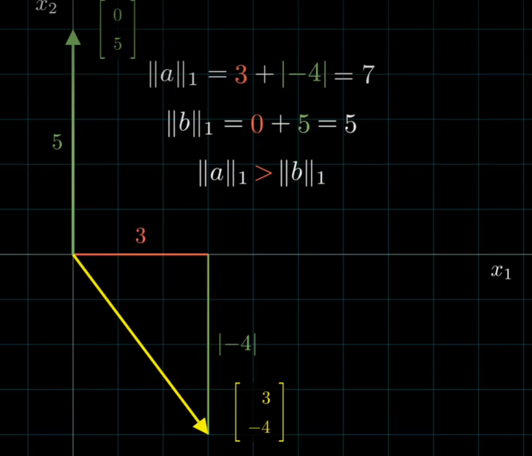

- 欧式距离L2：通过计算向量之间的欧几里得距离来衡量相似度。
- 点积：计算两个向量的点积，适合归一化后的向量。

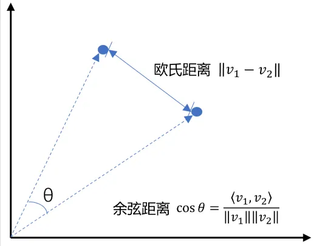

```python
import numpy as np
from numpy import dot
from numpy.linalg import norm
from openai import OpenAI
from dotenv import load_dotenv
import os

load_dotenv()
client = OpenAI(api_key=os.getenv("api_key"), base_url=os.getenv("base_url"))


def cos_sim(a, b):
    '''余弦相似度 -- 越大越相似'''
    return dot(a, b) / (norm(a) * norm(b))


def l2(a, b):
    '''欧式距离 -- 越小越相似'''
    x = np.asarray(a) - np.asarray(b)
    return norm(x)


def get_embeddings(texts, model="text-embedding-v3"):
    #  texts 是一个包含要获取嵌入表示的文本的列表，
    #  model 则是用来指定要使用的模型的名称
    #  生成文本的嵌入表示。结果存储在data中。
    data = client.embeddings.create(input=texts, model=model).data
    # print(data)
    # 返回了一个包含所有嵌入表示的列表
    return [x.embedding for x in data]


# 且能支持跨语言
# query = "global conflicts"
query = "我国开展舱外辐射生物学暴露实验"
documents = [
    "联合国就苏丹达尔富尔地区大规模暴力事件发出警告",
    "土耳其、芬兰、瑞典与北约代表将继续就瑞典“入约”问题进行谈判",
    "日本岐阜市陆上自卫队射击场内发生枪击事件 3人受伤",
    "国家游泳中心（水立方）：恢复游泳、嬉水乐园等水上项目运营",
    "我国首次在空间站开展舱外辐射生物学暴露实验",
]

query_vec = get_embeddings([query])[0]

doc_vecs = get_embeddings(documents)

print("余弦相似度:")
print(cos_sim(query_vec, query_vec))
for vec in doc_vecs:
    print(cos_sim(query_vec, vec))

print("\n欧式距离:")
print(l2(query_vec, query_vec))
for vec in doc_vecs:
    print(l2(query_vec, vec))

```

> 思考: 我们这个向量的数据存在哪里, 存mysql MongoDB? 这种数据库我们可以做查询语句,但是我们没有办法做空间的计算


#### 6. 向量数据库

- 在人工智能时代，向量数据库已成为数据管理和AI模型不可或缺的一部分。向量数据库是一种专门设计用来存储和查询向量嵌入数据的数据库。这些向量嵌入是AI模型用于识别模式、关联和潜在结构的关键数据表示。
- 随着AI和机器学习应用的普及，这些模型生成的嵌入包含大量属性或特征，使得它们的表示难以管理。这就是为什么数据从业者需要一种专门为处理这种数据而开发的数据库，这就是向量数据库的用武之地。


##### 6.1 常见的向量数据库:

- **Pinecone**
  - 重复检测：帮助用户识别和删除重复的数据
  - 排名跟踪：跟踪数据在搜索结果中的排名，有助于优化和调整搜索策略
  - 数据搜索：快速搜索数据库中的数据，支持复杂的搜索条件
  - 分类：对数据进行分类，便于管理和检索
  - 去重：自动识别和删除重复数据，保持数据集的纯净和一致性
- **Milvus**
  - 毫秒级搜索万亿级向量数据集
  - 简单管理非结构化数据
  - 可靠的向量数据库，始终可用
  - 高度可扩展和适应性强
  - 混合搜索
  - 统一的Lambda结构
  - 受到社区支持，得到行业认可
- **Chroma**
  - 功能丰富：支持查询、过滤、密度估计等多种功能
  - 即将添加的语言链（LangChain）、LlamaIndex等更多功能
  - 相同的API可以在Python笔记本中运行，也可以扩展到集群，用于开发、测试和生产
- **Faiss**
  - 不仅返回最近的邻居，还返回第二近、第三近和第k近的邻居
  - 可以同时搜索多个向量，而不仅仅是单个向量（批量处理）
  - 使用最大内积搜索而不是最小欧几里得搜索
  - 也支持其他距离度量，但程度较低。
  - 返回查询位置附近指定半径内的所有元素（范围搜索）
  - 可以将索引存储在磁盘上，而不仅仅是RAM中

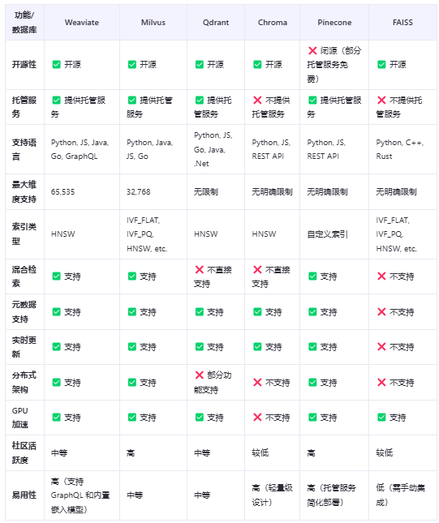

##### 6.2 如何选型向量数据库

在选择适合项目的向量数据库时，需要根据项目的具体需求、团队的技术背景和资源情况来综合评估。以下是一些建议和注意事项：

向量嵌入的生成

- 如果已经有了自己的向量嵌入生成模型，那么需要的是一个能够高效存储和查询这些向量的数据库
- 如果需要数据库服务来生成向量嵌入，那么应该选择提供这类功能的产品

延迟要求

- 对于需要实时响应的应用程序，低延迟是关键。需要选择能够提供快速查询响应的数据库
- 如果应用程序允许批量处理，那么可以选择那些优化了大批量数据处理的数据库

开发人员的经验

- 根据团队的技术栈和经验，选择一个易于集成和使用的数据库
- 如果团队成员对某些技术或框架更熟悉，那么选择一个能够与之无缝集成的数据库会更有利

##### 6.3 chromadb演示

- chroma学习：<https://zhuanlan.zhihu.com/p/680661442> 

```
# 安装模块
pip install chromadb==0.5.3
```

- 创建连接

```
import chromadb
client = chromadb.Client()
# 创建 client 时，设置数据持久化路径, 默认存储在内存,程序运行完时会丢失
# client = chromadb.PersistentClient(path=r"D:\software\chroma")
# 存在这个集合就返回，不存在就创建
collection = client.get_or_create_collection(name="test")
```

- 增删改查

```
import chromadb

client = chromadb.Client()
# 创建 client 时，设置数据持久化路径, 默认存储在内存,程序运行完时会丢失
# client = chromadb.PersistentClient(path=r"D:\software\chroma")
# 存在这个集合就返回，不存在就创建
collection = client.get_or_create_collection(name="test")

# 添加数据
collection.add(
    documents=["Article by john", "Article by Jack", "Article by Jill"], # 文本内容列表，每个元素是一段文本（如文章、句子等）
    embeddings=[[1, 2, 3], [4, 5, 6], [7, 8, 9]],  # 嵌入向量列表，每个元素是一个与 documents 对应的向量表示
    ids=["1", "2", "3"] # 自定义 ID 列表，用于唯一标识每条记录
)

# 查询数据
aa = collection.get(
    ids=["1"],
    where_document={"$contains": "john"}, # 表示文本内容中包含 "john" 的文档
    include=["embeddings"] # 包含嵌入向量, 出于性能考虑，默认不返回嵌入向量
)
# print(aa)

# 删除数据
collection.delete(
    ids=["1"]
)
# print(collection.get(include=["embeddings"]))

# 修改数据
collection.update(
    documents=["Article by john", "Article by Jack", "Article by Jill"],
    embeddings=[[10,2,3],[40,5,6],[70,8,9]],
    ids=["1", "2", "3"])
print(collection.get(include=["embeddings"]))
```

- 操作案例

```
import chromadb
from chromadb.config import Settings
import json
from openai import OpenAI
from dotenv import load_dotenv
import os


class MyVectorDBConnector:
    def __init__(self, collection_name):
        # 创建一个客户端
        chroma_client = chromadb.Client(Settings(allow_reset=True))

        # 创建一个 collection
        self.collection = chroma_client.get_or_create_collection(name=collection_name)
        

    def get_embeddings(self, texts, model="text-embedding-v3"):
        '''封装 qwen 的 Embedding 模型接口'''
        # print('texts', texts)
        data = client.embeddings.create(input=texts, model=model).data
        return [x.embedding for x in data]
    
    def add_documents(self, instructions, outputs):
        '''向 collection 中添加文档与向量'''
        # get_embeddings(instructions)
        # 将数据向量化
        embeddings = self.get_embeddings(instructions)

        # 把向量化的数据和原文存入向量数据库
        self.collection.add(
            embeddings=embeddings,  # 每个文档的向量
            documents=outputs,  # 文档的原文
            ids=[f"id{i}" for i in range(len(outputs))]  # 每个文档的 id
        )

        # print(self.collection.count())

    def search(self, query):
        '''检索向量数据库'''
        # 把我们查询的问题向量化, 在chroma当中进行查询
        results = self.collection.query(
            query_embeddings=self.get_embeddings([query]),
            n_results=2,
        )
        return results


if __name__ == '__main__':
    load_dotenv()
    client = OpenAI(api_key=os.getenv("api_key"), base_url=os.getenv("base_url"))
    # 读取文件
    with open('train_zh.json', 'r', encoding='utf-8') as f:
        data = [json.loads(line) for line in f]
    # print(data)
    # print(data[0:100])

    # 获取前10条的问题和输出
    instructions = [entry['instruction'] for entry in data[0:10]]
    outputs = [entry['output'] for entry in data[0:10]]

    # 创建一个向量数据库对象
    vector_db = MyVectorDBConnector("demo")

    # 向向量数据库中添加文档
    vector_db.add_documents(instructions, outputs)
    # print(vector_db.collection.get())
    # user_query = "白癜风"
    user_query = "得了白癜风怎么办？"
    results = vector_db.search(user_query)
    # print(results)

    for para in results['documents'][0]:
        print(para + "\n")
```

##### 6.4 chroma原理 

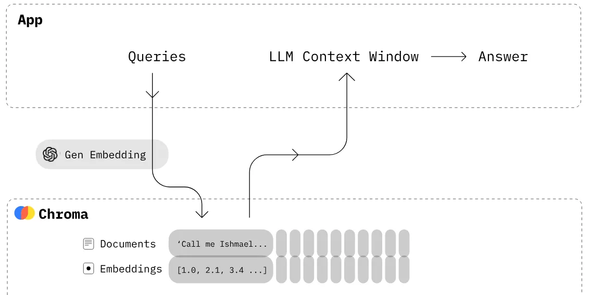

##### 6.5 Redis实现检索

###### 1. Redis介绍 

- Redis，英文全称是[Remote Dictionary Server](https://zhida.zhihu.com/search?content_id=235651583&content_type=Article&match_order=1&q=Remote+Dictionary+Server&zhida_source=entity)（远程字典服务），是一个开源的使用[ANSI C](https://zhida.zhihu.com/search?content_id=235651583&content_type=Article&match_order=1&q=ANSI+C&zhida_source=entity)语言编写、支持网络、可基于内存亦可持久化的日志型、Key-Value数据库，并提供多种语言的API。
- 与MySQL数据库不同的是，Redis的数据是存在内存中的。它的读写速度非常快，每秒可以处理超过10万次读写操作。因此redis被广泛应用于缓存，另外，Redis也经常用来做分布式锁。除此之外，Redis支持事务、持久化、[LUA 脚本](https://zhida.zhihu.com/search?content_id=235651583&content_type=Article&match_order=1&q=LUA+%E8%84%9A%E6%9C%AC&zhida_source=entity)、LRU 驱动事件、多种集群方案。

- 使用教程: https://www.cnblogs.com/ahmao/p/13746094.html 
- 下载地址: https://github.com/tporadowski/redis/releases

###### 2. redis使用

- 在正式操作`redis`之前，我们需要了解一下`redis`数据库中常用的数据类型：
  1. 字符串类型：`string`
  2. 哈希类型：`hash`
  3. 列表类型：`list`
  4. 集合类型：`set`
  5. 有序集合类型：`zset`
- 字符串类型操作:
  - 进终端cmd进行操作

```
# 如果设置的键不存在则为添加，如果设置的键已经存在则修改
# set key value
set name tuling

# 设置键值及过期时间，以秒为单位
# setex key seconds value
setex name 3 zhangsan

# 设置多个键值
# mset key1 value1 key2 value2 ...
mset name 柏汌 age 18 gender 男

# 根据键获取值，如果不存在则返回nil
# get key
get name
```

- 键操作

```
# 获取所有键
# keys pattern
keys *

# 查询包含字母n的键
# keys <regex>
keys n*

# 判断键是否存在，如果存在返回1；否则返回0
# exists key
exists name
exists address


# 查看键对应的值的类型
# type key
type age


# 删除键值对
# del key1 key2 ...
del age gender

# 清空数据
FLUSHDB
```

- ##### `hash`类型

  - ##### `hash`用于存储对象，对象的结构为：属性、值`(string)` 

```
# 设置单个属性
# hset key field value
hset user name tuling

# 设置多个属性
# hmset key field1 value1 field2 value2 ...
# 属性有两个：name、age
hmset py_stu name tuling age 10


# 获取指定键的所有字段
# hkeys key
hkeys py_stu


# 获取一个字段对应的值
# hget key field
hget py_stu name


# 删除字段：字段对应的值会被一起删除
# hdel key field1 field2 ...
hdel py_stu age
# 如果想要删除整个hash数据则使用del
del py_stu
```

- ##### `set`类型

  - 集合类型是无序的，并且集合中的元素类型为`string`。在集合中的元素具有唯一性，不能重复，并且集合类型没有修改操作。 

```
# 添加元素
# sadd key member1 member2 ...
sadd user_name_1 zhangsan lisi wangwu


# 获取元素
# smembers key
# 获取集合中的所有元素
smembers user_name_1

# 删除元素
# srem key
# 删除指定键user_name_1中的元素：wangwu
srem user_name_1 wangwu
```

- **zset类型**
  - `zset`类型是一个有序集合，元素为`string`类型。和无序集合一样，元素具有唯一性，不能重复，并没有修改操作。在有序集合中的每个元素都会关联一个`double`类型的`score`，表示权重，通过权重将元素从小到大排序。 

```
# 添加数据
# zadd key socre1 member1 socre2 member2 ...
# 向键user_name_2集合中添加元素: lisi、wangwu、zhaoliu、zhangsan 权重分别为4 5 6 3
zadd user_name_2 4 lisi 5 wangwu 6 zhaoliu 3 zhangsan


# 获取数据
# zrange key start stop
# start、stop为元素的索引
# 1.索引从左侧开始，第一个元素索引为0
# 2.索引可以是负数，表示从尾部开始计数，如-1表示最后一个元素
# 获取键user_name_2集合中的所有元素
zrange user_name_2 0 -1


# 删除数据
# zrem key member1 member2 ...
# 删除user_name_2集合中的元素: zhangsan
zrem user_name_2 zhangsan
```

- **list类型**

```
# 从列表左侧插入数据
# lpush key value1 value2 ...
lpush name_1 a b c


# 从列表右侧插入数据
# rpush key value1 value2 ...
rpush name_2 a b c


# 数据获取：获取列表数据的方向只能从左往右
# lrange key start stop
# 获取列表name_1、name_2中的所有元素
lrange name_1 0 -1
lrange name_2 0 -1
# start、stop为元素的索引
# 1.索引从左侧开始，第一个元素为0
# 2.索引可以是负数，表示从尾部开始计数，如-1表示最后一个元素


# 删除指定元素
# lrem key count value
# 根据索引count删除对应的值
# count > 0: 从左往右删除
# count < 0: 从右往左删除
# count = 0: 删除所有
# 创建测试列表并左插入三组a、b
lpush test_list a b a b a b
# 查看列表数据
lrange test_list 0 -1
# 从test_list列表中的右侧开始删除2个b字母
lrem test_list -2 b
# 查看删除效果
lrange test_list 0 -1
```

- **使用redis实现检索**

```
import json
import redis

# 创建 Redis 连接
r = redis.Redis(host='127.0.0.1', port=6379, decode_responses=True)


# 从JSON文件中读取数据
def read_data():
    with open('train_zh.json', 'r', encoding='utf-8') as f:
        data = [json.loads(line) for line in f]

    # print(data[0:100])
    instructions = [entry['instruction'] for entry in data[0:1000]]
    outputs = [entry['output'] for entry in data[0:1000]]
    return instructions, outputs


# 将读取出来的数据存入Redis中
def set_redis_documents(instructions, outputs):
    for instruction, output in zip(instructions, outputs):
        r.set(instruction, output)


# 在Redis中根据关键词进行模糊搜索
def search_instructions(instruction_key, top_n=3):
    keys = r.keys(pattern='*' + instruction_key + '*')
    data = []
    for key in keys:
        data.append(r.get(key))
    return data[:top_n]


# 先从文件中读取数据
instructions, outputs = read_data()
# 在把数据存入到Redis中
set_redis_documents(instructions, outputs)
# 在Redis中进行检索
data = search_instructions('怀孕')
print(data)
```


### 四. 实战:**基于RAG知识库实现智能AI系统** 

- 模块下载

```
# 先下载解析PDF和word的模块
pip install -i https://pypi.tuna.tsinghua.edu.cn/simple python-docx
pip  install -i https://pypi.tuna.tsinghua.edu.cn/simple pdfminer.six
```

- 案例代码

```python
from dotenv import load_dotenv
from openai import OpenAI
from pdfminer.high_level import extract_pages
from pdfminer.layout import LTTextContainer
import chromadb
import os


# 按照固定字符切割文档
def sliding_window_chunks(text, chunk_size, stride):
    return [text[i:i + chunk_size] for i in range(0, len(text), stride)]


# 读取PDF
def extract_text_from_pdf(filename, page_numbers=None, min_line_length=1):
    '''从 PDF 文件中（按指定页码）提取文字'''
    paragraphs = []
    buffer = ''
    full_text = ''
    # 提取全部文本
    for i, page_layout in enumerate(extract_pages(filename)):

        # 如果指定了页码范围，跳过范围外的页
        if page_numbers is not None and i not in page_numbers:
            continue
        for element in page_layout:
            # 检查element是不是文本
            if isinstance(element, LTTextContainer):
                # print(element.get_text())
                # 将换行和空格去掉
                full_text += element.get_text().replace("\n", "").replace(" ", "")

    if full_text:
        # 调用切割函数
        text_chunks = sliding_window_chunks(full_text, 250, 100)
        for text in text_chunks:
            paragraphs.append(text)
    return paragraphs


# 向量数据库类
class MyVectorDBConnector:
    def __init__(self, collection_name):
        chroma_client = chromadb.Client()
        # 创建一个 collection
        self.collection = chroma_client.get_or_create_collection(name=collection_name)

    # 使用智谱的模型进行向量化
    def get_embeddings(self, texts, model="text-embedding-v1"):
        '''封装 qwen 的 Embedding 模型接口'''
        # print('texts', texts)
        data = client.embeddings.create(input=texts, model=model).data
        return [x.embedding for x in data]

    def add_documents(self, documents):
        '''向 collection 中添加文档与向量'''
        self.collection.add(
            embeddings=self.get_embeddings(documents),  # 每个文档的向量
            documents=documents,  # 文档的原文
            ids=[f"id{i}" for i in range(len(documents))]  # 每个文档的 id
        )

    def search(self, query, top_n):
        '''检索向量数据库'''
        results = self.collection.query(
            query_embeddings=self.get_embeddings([query]),
            n_results=top_n
        )
        return results


class RAG_Bot:
    def __init__(self, vector_db, n_results=2):
        self.vector_db = vector_db
        self.n_results = n_results

    # llm模型
    def get_completion(self, prompt, model="qwen-plus"):
        '''封装 千问 接口'''
        messages = [{"role": "user", "content": prompt}]
        response = client.chat.completions.create(
            model=model,
            messages=messages,
            temperature=0,  # 模型输出的随机性，0 表示随机性最小
        )
        return response.choices[0].message.content

    def chat(self, user_query):
        # 1. 检索
        search_results = self.vector_db.search(user_query, self.n_results)
        print('search_results:', search_results)
        # 2. 构建 Prompt
        prompt = prompt_template.replace("__INFO__", "\n".join(search_results['documents'][0])).replace("__QUERY__",
                                                                                                        user_query)
        print('prompt:', prompt)
        # 3. 调用 LLM
        response = self.get_completion(prompt)
        return response


if __name__ == '__main__':
    load_dotenv()
    client = OpenAI(api_key=os.getenv("api_key"),
                    base_url="https://dashscope.aliyuncs.com/compatible-mode/v1")
    prompt_template = """
    你是一个问答机器人。
    你的任务是根据下述给定的已知信息回答用户问题。
    确保你的回复完全依据下述已知信息。不要编造答案。
    如果下述已知信息不足以回答用户的问题，请直接回复"我无法回答您的问题"。

    已知信息:
    __INFO__

    用户问：
    __QUERY__

    请用中文回答用户问题。
    """
    # 使用示例
    docx_filename = "财务管理文档.pdf"
    # 读取Word文件
    # paragraphs = extract_text_from_docx(docx_filename, min_line_length=10)
    paragraphs = extract_text_from_pdf(docx_filename, page_numbers=[0, 1, 2], min_line_length=10)
    print(paragraphs)

    # 创建一个向量数据库对象
    vector_db = MyVectorDBConnector("demo")
    # 向向量数据库中添加文档
    vector_db.add_documents(paragraphs)

    # 创建一个RAG机器人
    bot = RAG_Bot(
        vector_db
    )
    user_query = "财务管理权限划分?"
    response = bot.chat(user_query)
    print(response)

```

